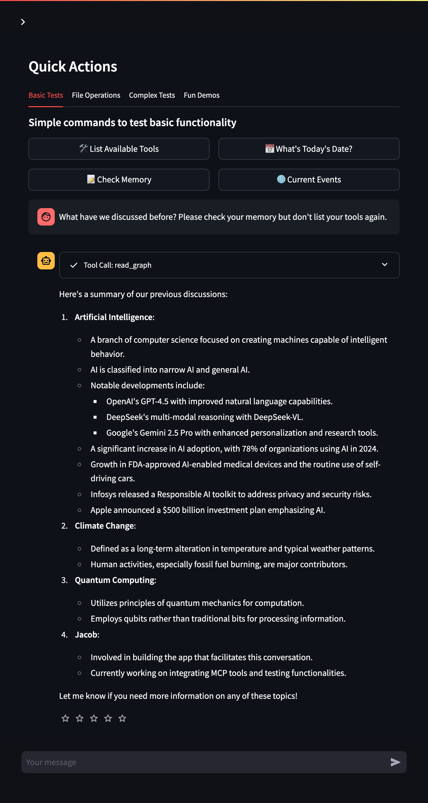

# MCP-Enhanced AI Agent Service Toolkit

[](https://opensource.org/licenses/MIT)

This project provides a powerful AI agent service built with LangChain and LangGraph, significantly enhanced with Anthropic's Model Context Protocol (MCP). It allows agents to leverage external tools for persistent memory, filesystem access, shell commands, web search, and more, offering advanced capabilities beyond standard function calling.

This toolkit is a fork, heavily modified to integrate and showcase MCP functionalities.

---

**⚠️ SECURITY WARNING: POWERFUL TOOLS INSIDE!**

This agent integrates MCP tools that grant significant capabilities, including **filesystem access** and **shell command execution**. These tools can interact with the environment where the agent is run.

**It is STRONGLY RECOMMENDED to run this agent ONLY within the provided Docker container environment.** This isolates the agent and its tools, limiting potential security risks associated with unintended filesystem modifications or command executions. **DO NOT run this agent directly on your host machine without fully understanding the risks and implementing appropriate sandboxing.**

---

## Quickstart (Docker Recommended)

Get up and running quickly using Docker:

1.  **Clone the repository:**
    ```bash
    git clone https://github.com/madtank/agent-service-toolkit.git
    cd mcp-agent # Or your repository directory name
    ```

2.  **Set up Environment Variables:**
    Copy the example environment file and edit it with your API keys and settings:
    ```bash
    cp .env.example .env
    nano .env # Or your preferred editor
    ```
    *   Ensure at least one LLM provider (e.g., `OPENAI_API_KEY`) is configured.
    *   Review settings for LangSmith, authentication, and tool keys (e.g., `PERPLEXITY_API_KEY`).

3.  **Build and Run with Docker Compose:**
    This command uses `watch` mode for automatic reloading during development.
    ```bash
    docker compose watch
    ```

4.  **Access the Application:**
    *   **Streamlit UI:** Open your browser to `http://localhost:8501`
    *   **Agent Service API:** The FastAPI service is available at `http://localhost:8080` (Docs: `/docs` or `/redoc`).

## Features

*   **LangGraph Foundation:** Built on LangGraph for creating robust, stateful agent applications.
*   **Model Context Protocol (MCP) Integration:** Leverages MCP for dynamic and powerful tool usage.
    *   **Persistent Memory:** Knowledge graph capabilities via `@modelcontextprotocol/server-memory`.
    *   **Filesystem Access:** Read/write files within a container-defined volume via `@modelcontextprotocol/server-filesystem`.
    *   **Shell Command Execution:** Run shell commands within the container via `mcp-shell`.
    *   **Web Search:** Integrated DuckDuckGo search via `duckduckgo-mcp-server`.
*   **Extensible:** Easily add more MCP servers or standard LangChain tools.
*   **Streamlit UI:** Simple web interface for interacting with the agent.
*   **FastAPI Backend:** Exposes the agent logic via a REST API.
*   **Dockerized:** Recommended containerized setup for security and ease of use.
*   **Modern Python Tooling:** Uses `uv` for fast dependency management.

## Architecture Overview

The toolkit consists of:

1.  **Agent Service (`agent_service`):** A FastAPI application serving the LangGraph agent (`mcp_agent.py`). It initializes and manages the MCP client (`MultiServerMCPClient`) and the associated MCP server processes within the container.
2.  **Streamlit UI (`streamlit_app`):** A web interface that communicates with the Agent Service API to provide a chat experience.
3.  **MCP Servers:** Processes (like `npx`, `uvx`) started by the `MultiServerMCPClient` within the `agent_service` container, providing tools via standard I/O or other transports.
4.  **Docker Environment:** `compose.yaml` defines the services, networking, and volumes (like mapping `./data` to `/app/data` for the filesystem tool).

## Model Context Protocol (MCP) Details

MCP standardizes how agents interact with external tools, enabling more complex and stateful interactions than simple function calls.



### Configured MCP Servers

The MCP servers are now configured via a dedicated JSON configuration file located at `config/mcp_config.json`. This provides a clean separation between configuration and code.

Current MCP servers include:
- **mcp-shell**: Provides shell access within the container
- **memory**: Knowledge graph memory for storing and retrieving information
- **perplexity-ask**: Integration with Perplexity API for search
- **filesystem**: File system access (mapped to /app/data)

### Adding or Modifying MCP Servers

To add or modify MCP servers, follow these steps:

1. **Edit the MCP Configuration File**:
   - Open `config/mcp_config.json`
   - Add your new server configuration inside the `servers` object

   Example for adding the Brave Search MCP server:
   ```json
   {
     "servers": {
       // ...existing servers...
       "brave-search": {
         "command": "npx",
         "args": ["-y", "@modelcontextprotocol/server-brave-search"],
         "transport": "stdio",
         "env": {
           "BRAVE_API_KEY": "${BRAVE_API_KEY}"
         }
       }
     }
   }
   ```

2. **Handle Environment Variables and Secrets**:
   - For non-sensitive configuration, you can use values directly in the JSON
   - For sensitive data like API keys:
     - Add the variable to your `.env` file (e.g., `BRAVE_API_KEY=your_api_key`)
     - Add the variable to `src/core/settings.py` like other API keys:
       ```python
       class Settings(BaseSettings):
           # ...existing settings...
           BRAVE_API_KEY: SecretStr | None = None
       ```
     - Reference it in the config using `${VARIABLE_NAME}` syntax

3. **Update Docker Configuration** (if needed):
   - If your MCP server requires additional volume mounts or environment variables:
     - Update the `agent_service` section in `compose.yaml`
     - If you need additional volumes mounted, add them to the `volumes` list

4. **Restart the Application**:
   - Rebuild and restart Docker containers: `docker compose up --build`

The application will automatically:
- Load the configuration from `config/mcp_config.json`
- Substitute environment variables using the `${VARIABLE_NAME}` syntax
- Initialize MCP servers based on the configuration

### How Environment Variable Substitution Works

The system supports variable substitution in both the `env` section and `args` array:

- Variables are specified using `${VARIABLE_NAME}` syntax
- Values are automatically retrieved from settings.py
- SecretStr values are properly handled to extract their actual values
- Data, memory, and config paths are automatically managed

Example configuration with environment variables:
```json
"filesystem": {
  "command": "npx",
  "args": ["-y", "@modelcontextprotocol/server-filesystem", "${DATA_DIR_PATH}", "/"],
  "transport": "stdio"
}
```

## Development

### Using Docker (Recommended)

The `docker compose watch` command provides the best development experience:

*   It automatically rebuilds/restarts services when relevant source files change (see `develop.watch` sections in [`compose.yaml`](compose.yaml)).
*   Ensures the agent runs in the intended isolated environment.
*   Changes to dependencies (`pyproject.toml`, [`uv.lock`](uv.lock)) or Dockerfiles still require a manual rebuild: `docker compose up --build`.

### Local Development (Not Recommended)

**⚠️ DANGER:** As stated previously, running this agent directly on your host machine is **strongly discouraged** due to security risks from MCP tools. Proceed only if you understand the risks and have implemented sandboxing.

1.  **Prerequisites:** Ensure Python (3.10+), `uv`, and any necessary MCP server dependencies (like `npx` for Node.js-based servers) are installed on your host.
2.  **Install Dependencies:**
    ```bash
    uv sync
    ```
3.  **Set Environment Variables:** Ensure variables from [`.env`](.env) are available in your shell (e.g., `export $(cat .env | xargs)` or use a tool like `direnv`).
4.  **Run Agent Service:**
    ```bash
    python src/run_service.py
    ```
5.  **Run Streamlit App (in a separate terminal):**
    ```bash
    streamlit run src/streamlit_app.py
    ```
6.  **Access the App:** Open your browser to `http://localhost:8501`.

## Configuration

*   **.env:** Main configuration for API keys, LangSmith, etc.
*   **src/agents/mcp_agent.py:** Agent instructions, MCP server definitions (`get_tools`), LangGraph setup (`initialize_agent`).
*   **compose.yaml:** Docker service definitions, ports, volumes, environment variables passed to containers, watch configurations.

## License

This project is licensed under the MIT License - see the [LICENSE](LICENSE) file for details.
